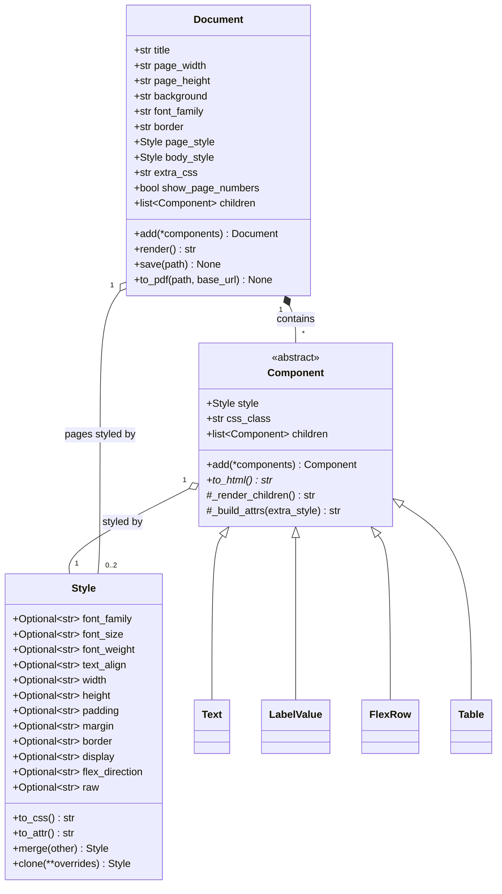
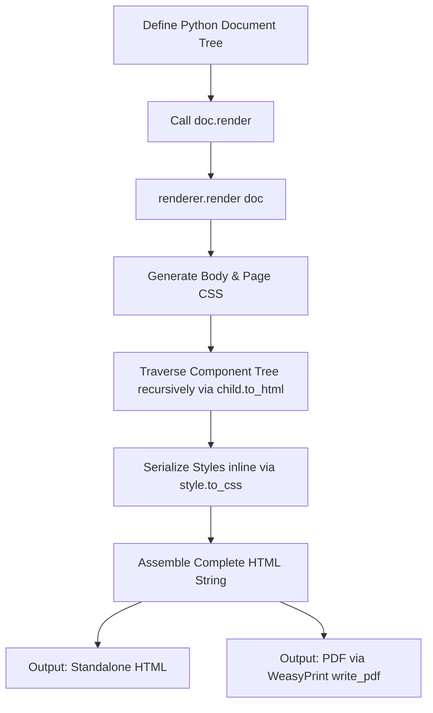

# HTML Document Engine & Builder: Software Documentation

This document provides a comprehensive overview of the **HTML Document Engine** (`html_engine`) and **Document Builder** (`document_builder`) codebase. It details the system architecture, component catalog, usage patterns, security features, and layout styles.

The HTML Document Engine is a lightweight, declarative Python framework designed to programmatically construct A4 printable documents (e.g. certificates, land records, invoices, letters) and compile them directly into HTML and PDF.

---

## 1. Architectural Design & Class Hierarchy

The engine follows a declarative tree-structured layout where components are nested under a root `Document`. Styling is handled by an immutable-ish `Style` dataclass mapping directly to CSS properties.



### Core Classes

1. **`html_engine.styles.Style`**:
   - Represents standard CSS styling rules (typography, borders, margins, flexbox, CSS Grid).
   - Maps Python snake_case variables to CSS kebab-case (e.g. `font_weight` -> `font-weight`).
   - Properties default to `None` and are omitted when serializing to inline CSS styles.
   - Merging styles via `style_a.merge(style_b)` (or `style_a + style_b`) produces a new `Style` instance where `style_b` overrides `style_a`.
   - Offers unit helper utilities (`px`, `pct`, `em`, `rem`, `pt`) for type-safe CSS sizing.

2. **`html_engine.components.base.Component`**:
   - The abstract base class representing any renderable element.
   - Provides methods to traverse children (`_render_children()`) and assemble tag attributes (`_build_attrs()`).
   - Subclasses must implement `to_html()`.

3. **`html_engine.document.Document`**:
   - The root document model that configures page styling (such as dimensions, border limits, fonts, and background).
   - Coordinates rendering and file exports.

---

## 2. The Rendering Pipeline

Converting Python components into styled, printable documents follows a structured pipeline:



* **Global Styling & Pagination**: Global document parameters and print styles are written directly into a `<style>` block in the HTML header. If `show_page_numbers=True`, print styles are injected to display page numbers in the bottom-right corner of each page using CSS Paged Media.
* **Component Traversal**: The engine walks the component tree invoking `to_html()` on children. If a parent contains multiple elements, it aggregates their outputs sequentially.
* **Inline CSS Construction**: Component styles are serialized inline to isolate nodes from stylesheet conflicts and guarantee rendering consistency in PDF render engines.
* **PDF Compile & Resolution**: Using `weasyprint`, the HTML string is parsed and written to a PDF file. The optional `base_url` argument ensures relative asset paths (like images) resolve correctly.

---

## 3. Component Catalog

Components are organized into functional groups:

### 3.1 Layout & Grids
* **`Div`**: Standard container element (`<div>`). Used for grouping elements and basic styling.
* **`FlexRow` / `FlexCol`**: Flexbox layouts with preconfigured directions and custom `gap` spacing.
* **`Grid`**: A CSS Grid container that maps columns template definitions. Passing an integer column count (e.g. `columns=12`) translates it to `repeat(12, 1fr)`.
* **`GridItem`**: A grid child element supporting column/row spanning constraints (e.g., `column_span=4` translates to `grid-column: span 4`).
* **`AbsoluteBox`**: Position wrapper (`position: absolute`) with `top`/`right`/`bottom`/`left` properties. Essential for stamps, signatures, or photo coordinates.
* **`Card`**: Styled page frame container mimicking standard cards (preset padding, border, subtle box shadow, and white background).

### 3.2 Content Elements
* **`Text` / `Heading` / `Paragraph`**: Basic text nodes wrapping `<span>`, `<h1>-<h6>` (via `level`), and `<p>` tags.
  - *Security*: Auto-escapes inputs by default to protect against HTML Injection / XSS. Can be bypassed via `escape=False`.
* **`Link`**: Renders anchor elements (`<a>`) with `href` and `target` attributes. Auto-escapes string content by default.
* **`RawHTML`**: Renders arbitrary string structures verbatim. Bypasses all escape validation safeguards.
* **`Image`**: Renders image tags (``).
  - *Grayscale*: Passing `grayscale=True` automatically appends CSS filters.
  - *Data URI Embedding*: Passing `embed=True` reads local image assets and encodes them directly inside the source attribute as base64 strings, ensuring the HTML file is fully self-contained.

### 3.3 Data Fields
* **`LabelValue`**: A flex container laying out a fixed-width label on the left and a value on the right. Value arguments can be plain strings or nested layout components. Supports auto-escaping of strings.
* **`FieldGroup`**: A vertical stack wrapper that automatically adds configurable spacing (margins) to child elements (excluding the final child).
* **`MultiFieldRow`**: Horizontal layout wrapper for rendering multiple `LabelValue` pairs on a single row.

### 3.4 Tables
* **`Table`**: Renders an HTML `<table>`. Can be built from nested table rows, or dynamically from simple header and row lists.
* **`TableRow`**: Represents a table row (`<tr>`). Wraps nested raw values into table cells automatically.
* **`TableCell`**: Represents table cells (`<td>`/`<th>`). Supports merging cells (`colspan`/`rowspan`) and auto-escapes string content.

### 3.5 Spacers & Lists
* **`Spacer`**: Empty block with a fixed CSS height.
* **`HorizontalRule`**: Divider line (`<hr>`).
* **`PageBreak`**: Tells the PDF compile engine to break pages at print time.
* **`ListItem` / `UnorderedList` / `OrderedList`**: Custom bulleted and numbered list structures with auto-escaping.

---

## 4. Design Patterns in Practice

The builders in `document_builder` illustrate two different design strategies:

### Pattern A: Absolute Positioning Layout
* **Example**: [citizenship/layout.py](file:///home/moon/pragya/babu-documentation/document_builder/citizenship/layout.py)
* **Goal**: High-fidelity reproduction of single-page physical documents (e.g. ID cards, certificates).
* **Approach**: Page dimensions are rigid, and all elements (emblem, stamp, photo, signature, fields panel) are positioned relative to coordinates via `AbsoluteBox` wrappers.
* **Suitability**: Strict certificates where layout constraints are constant.

### Pattern B: Flow & Tabular Layout
* **Example**: [laalpurja/layout.py](file:///home/moon/pragya/babu-documentation/document_builder/laalpurja/layout.py)
* **Goal**: Documents that grow dynamically depending on contents (e.g. land registries, invoices, reports).
* **Approach**: Page heights are dynamic. Flex row containers group blocks vertically, and dynamic item listings are structured inside custom HTML tables.
* **Suitability**: Invoices and tabular reports where length varies.

---

## 5. Developer Guide: Building an Invoice

Below is a complete, self-contained example showing how to compose a general document using the engine:

```python
from html_engine import (
    Document, Style, px, pct, Heading, Paragraph, Text, 
    FlexRow, FlexCol, Table, TableRow, TableCell, 
    Spacer, HorizontalRule, Link, Card, PageBreak
)

def build_client_invoice(invoice_no: str, client_name: str, items: list) -> Document:
    # 1. Document Configuration
    doc = Document(
        title=f"Invoice {invoice_no}",
        page_width="850px",
        page_height="auto",
        min_height="1100px",
        background="#ffffff",
        border="1px solid #ddd",
        font_family="'Inter', Arial, sans-serif",
        show_page_numbers=True
    )

    # 2. Reusable Styling Profiles
    header_style = Style(color="#0f9d58", font_weight="bold", margin="0")
    label_style = Style(font_weight="bold", color="#555")
    cell_preset = Style(padding="12px", border_bottom="1px solid #eee")

    # 3. Add Content Elements
    doc.add(
        # Invoice Header
        FlexRow(
            FlexCol(
                Heading("ACME SERVICES CO.", level=2, style=header_style),
                Paragraph("Tech District, Building 500", style=Style(color="#777", margin="4px 0 0 0"))
            ),
            FlexCol(
                Heading("INVOICE", level=1, style=Style(margin="0", color="#333")),
                Text(f"Serial: {invoice_no}", style=Style(font_weight="bold", font_size="14px")),
                style=Style(align_items="flex-end")
            ),
            style=Style(justify_content="space-between", align_items="center")
        ),
        Spacer(height="20px"),
        HorizontalRule()
    )

    # 4. Billing Details Card
    billing_card = Card(
        Heading("Billing Information", level=3, style=Style(margin="0 0 10px 0")),
        FlexRow(
            FlexCol(Text("Client Name:", style=label_style), Text(client_name)),
            FlexCol(Text("Payment Method:", style=label_style), Text("Credit Card ending in 9942")),
            style=Style(justify_content="space-between", width="100%")
        )
    )
    doc.add(Spacer(height="20px"), billing_card, Spacer(height="15px"))

    # 5. Items Table
    rows = []
    total = 0.0
    for it in items:
        sub = it["qty"] * it["price"]
        total += sub
        rows.append(
            TableRow(
                it["desc"],
                str(it["qty"]),
                f"${it['price']:.2f}",
                f"${sub:.2f}",
                cell_style=cell_preset
            )
        )

    invoice_table = Table(
        headers=[
            TableCell("Description", style=Style(text_align="left", font_weight="bold", padding="10px", background="#f5f5f5")),
            TableCell("Qty", style=Style(font_weight="bold", padding="10px", background="#f5f5f5")),
            TableCell("Rate", style=Style(font_weight="bold", padding="10px", background="#f5f5f5")),
            TableCell("Amount", style=Style(font_weight="bold", padding="10px", background="#f5f5f5", text_align="right"))
        ],
        children=rows,
        tfoot_rows=[
            TableRow(
                TableCell("Total Balance Due:", colspan=3, style=Style(text_align="right", font_weight="bold", padding="12px")),
                TableCell(f"${total:.2f}", style=Style(text_align="right", font_weight="bold", padding="12px", color="#0f9d58", font_size="16px"))
            )
        ]
    )
    doc.add(invoice_table)

    # 6. Footer Note with a Link
    doc.add(
        Spacer(height="40px"),
        Paragraph("Thank you for your business!", style=Style(text_align="center", font_style="italic")),
        FlexRow(
            Text("For billing inquiries, please visit our "),
            Link("Support Center", "https://acme.example.com/support", target="_blank"),
            style=Style(justify_content="center")
        )
    )

    return doc

# Usage:
# doc = build_client_invoice("INV-4820", "John Doe Corp", [{"desc": "Cloud Infrastructure Setup", "qty": 1, "price": 1200.0}])
# doc.save("invoice.html")
```

---

## 6. Implementation Fixes

The following deficiencies were fixed in the codebase:

1. **Incorrect Imports in Generator Scripts**:
   - The document generation scripts in `document_builder/citizenship/generate.py` and `document_builder/laalpurja/generate.py` were importing modules from `documents.*` which caused import failures. They have been updated to target `document_builder.*` correctly.
2. **Unnecessary `__init__.py` Files**:
   - Package-level initializers containing only comment placeholders (e.g. `document_builder/__init__.py`) and broken backups starting with a dot (e.g. `document_builder/laalpurja/.__init__.py`) were removed.
3. **HTML Injection Vulnerability**:
   - Standard components now automatically escape string content using python's `html.escape()`. Custom tags must be passed explicitly via `RawHTML` or by setting `escape=False`.
4. **PDF Asset Path Resolution**:
   - The PDF engine now supports a `base_url` argument to ensure relative file references (e.g. local signature images or photos) resolve correctly during PDF rendering.
