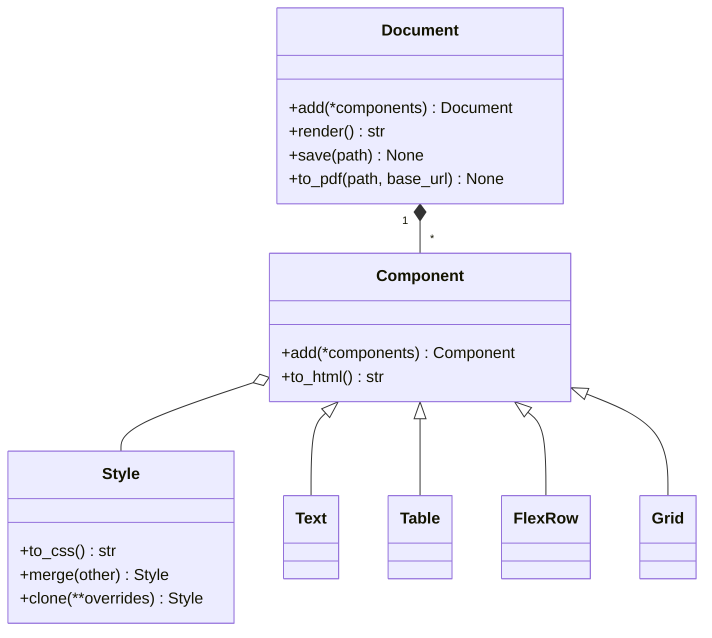

# Babu Document Digitization: Technical Documentation

The project turns Nepali document data into printable HTML. It contains a
small reusable HTML document engine, document-specific builders, an
information-extraction pipeline, and an in-progress visual verification
controller for improving rendered layouts safely.

## Architecture

```text
source image
  -> OCR / extraction data
  -> document builder
  -> html_engine
  -> standalone HTML (optional PDF)
  -> rendered PNG
  -> controller visual verification (planned repair loop)
```

| Area | Location | Responsibility |
| --- | --- | --- |
| HTML engine | `html_engine/` | Builds styled HTML and optionally exports PDF. |
| Builders | `document_builder/` | Defines reusable layouts for citizenship and land-ownership documents. |
| Extraction | `information_extraction/` | Extracts document fields and selects the appropriate builder/schema. |
| Controller | `controller/` | Compares source and rendered PNGs; future home of the bounded repair workflow. |
| Outputs | `output/` | Example generated documents and renders. |

## HTML document engine

`html_engine` is a dependency-light, declarative Python library for composing
printable documents from a tree of components. A `Document` owns page-level
configuration and child components; `Style` objects produce CSS; each
component renders itself and its children to HTML.



### Rendering and export

`Document.render()` traverses the component tree and returns a complete HTML
document. Components use inline styles for local layout; the renderer adds
document and print CSS. `Document.save()` writes the HTML. `Document.to_pdf()`
uses WeasyPrint when it is installed, and accepts `base_url` so relative image
paths can resolve during PDF generation.

### Components

| Group | Components |
| --- | --- |
| Text and media | `Text`, `Heading`, `Paragraph`, `Link`, `RawHTML`, `Image` |
| Layout | `Div`, `FlexRow`, `FlexCol`, `Grid`, `GridItem`, `AbsoluteBox`, `Card` |
| Fields | `LabelValue`, `FieldGroup`, `MultiFieldRow` |
| Tables | `Table`, `TableRow`, `TableCell` |
| Supporting blocks | `Spacer`, `HorizontalRule`, `PageBreak`, `ListItem`, `UnorderedList`, `OrderedList` |

Normal text components escape string content by default. Use `RawHTML` or
`escape=False` only for trusted markup. `Image(embed=True)` can embed a local
asset as a data URI, making the generated HTML self-contained.

### Minimal example

```python
from html_engine import Document, Heading, LabelValue, Style

doc = Document(title="Certificate", page_width="1200px", lang="ne")
doc.add(
    Heading("Government of Nepal", level=1, style=Style(text_align="center")),
    LabelValue("Name:", "राम बहादुर श्रेष्ठ"),
)
doc.save("output/certificate.html")
```

## Document builders

`document_builder/registry.py` maps document types to a layout builder and the
matching extraction schema.

| Document type | Builder | Layout approach |
| --- | --- | --- |
| `citizenship` | `document_builder/citizenship/layout.py` | Coordinate-based layout for rigid, single-page certificates. |
| `laalpurja` | `document_builder/laalpurja/layout.py` | Flow and table-based layout for a variable number of land records. |

Use absolute positioning for stable physical forms such as certificates. Use
flow, flex, grid, and tables when content length or row counts vary.

## Information extraction

`information_extraction/` contains the current digitization path. Its
`pipeline.digitize_document()` entry point accepts a document type, source
image, and output HTML path. JSON schemas for citizenship and land-ownership
records live in `information_extraction/schemas/`.

The builder should be given structured, validated fields; it should not need to
infer document meaning from OCR text itself. Missing or uncertain values should
remain explicit rather than being invented during rendering.

## Visual verification controller

The controller begins as an observation-only safety layer. Run it from its
directory after setting `OPENAI_API_KEY` in `controller/.env`:

```bash
cd controller
python document_verifier.py input.png output.png --output report.json
```

It sends the reference PNG and rendered PNG to a vision-capable model and
returns a validated `VerificationReport`. The report contains an overall
decision, visual discrepancies, severity, confidence, and a human-review flag.
It does not modify images, data, layouts, or HTML.

### Planned repair workflow

LangChain supplies the multimodal model call and typed structured output.
LangGraph should orchestrate the future stateful workflow, where retries and
approval require explicit control.

```text
OCR JSON + base layout
  -> render candidate PNG
  -> compare source and candidate
  -> pass: accept
  -> mismatch: propose constrained patch
  -> validate patch against allowed blocks/properties
  -> apply patch, render, and re-check (bounded retries)
  -> unresolved or low confidence: human review
```

The model must never freely replace the HTML layout. It should propose a typed
patch limited to known reusable blocks and permitted style or content changes.
The local renderer must validate and apply every patch, preserve an audit trail
of each attempt, and enforce a retry limit.

## Setup and common commands

```bash
python3 -m venv .venv
source .venv/bin/activate
pip install -r requirements.txt

# Generate sample layouts
python document_builder/citizenship/test-generate-citzenship.py
python document_builder/laalpurja/test-generate-laalpurja.py

# Compare a source render pair
cd controller
cp .env.example .env
# Set OPENAI_API_KEY in .env
python document_verifier.py
```

PDF export additionally requires `weasyprint`. The vision verifier requires an
OpenAI API key and sends both supplied images to the configured model; do not
use sensitive documents until data-handling requirements are approved.
