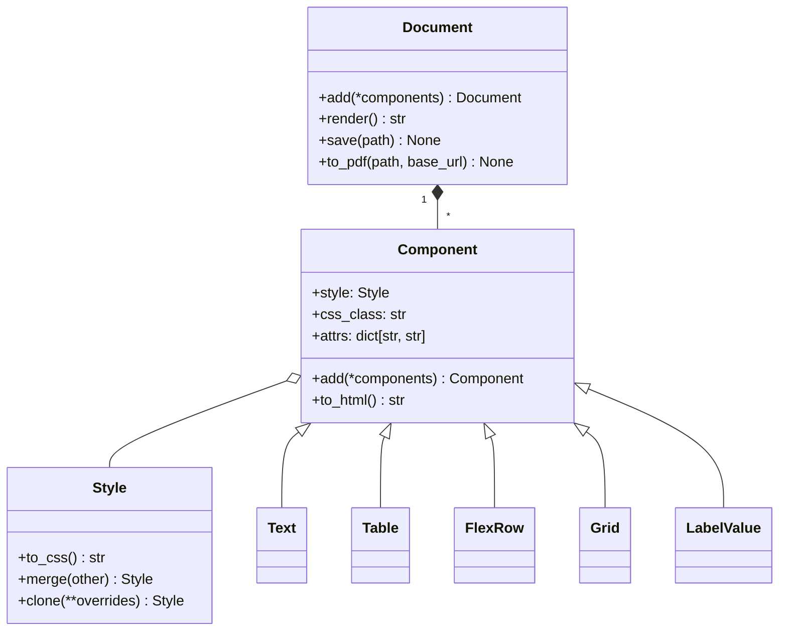

# Babu Document Digitization: Technical Documentation

The project turns Nepali document images into verified, printable HTML. It
contains a reusable HTML document engine, document-specific layout builders,
an OCR-based extraction pipeline, and a LangGraph controller that closes the
loop between extraction, rendering, verification, and human review.

## Architecture

```text
source image
  → OCR / Datalab extraction
  → structured JSON (validated against schema)
  → document builder  →  html_engine  →  HTML + PNG
  → controller: verify → human review → repair (bounded loop)
```

| Area | Location | Responsibility |
|---|---|---|
| HTML engine | `html_engine/` | Builds styled HTML; optional PDF via WeasyPrint. |
| Builders | `document_builder/` | Layouts for citizenship and land-ownership documents. |
| Extraction | `information_extraction/` | OCR extraction, field parsing, schema registry. |
| Controller | `controller/` | LangGraph pipeline: extract → build → verify → review → repair. |
| Outputs | `output/` | Sample generated HTML and images. |

---

## HTML document engine

`html_engine` is a dependency-light, declarative Python library for composing
printable documents from a tree of components. A `Document` owns page-level
configuration; `Style` objects produce inline CSS; each component renders
itself and its children to an HTML string.


```mermaid
classDiagram
    class Document {
        +add(*components) Document
        +render() str
        +save(path) None
        +to_pdf(path, base_url) None
    }
    class Component {
        +style: Style
        +css_class: str
        +attrs: dict[str, str]
        +add(*components) Component
        +to_html() str
    }
    class Style {
        +to_css() str
        +merge(other) Style
        +clone(**overrides) Style
    }
    Document "1" *-- "*" Component
    Component o-- Style
    Component <|-- Text
    Component <|-- Table
    Component <|-- FlexRow
    Component <|-- Grid
    Component <|-- LabelValue
```

### Arbitrary HTML attributes (`attrs`)

Every `Component` subclass accepts an `attrs: dict[str, str]` parameter that
is emitted verbatim as HTML attributes. Layout builders use this to attach
`contenteditable="true"` and `data-field="field_name"` to every extracted
value element:

```python
Text(d["owner_name"], attrs={"contenteditable": "true", "data-field": "owner_name"})
LabelValue("Name", d["owner_name"], value_attrs={"contenteditable": "true", "data-field": "owner_name"})
```

`LabelValue` accepts a separate `value_attrs` dict that targets the inner
value `<div>` rather than the outer container.

### Rendering and export

`Document.render()` traverses the component tree and returns a complete HTML
string. `Document.save()` writes it to disk. `Document.to_pdf()` uses
WeasyPrint when installed; pass `base_url` so relative image paths resolve
during PDF generation.

`Document(extra_css=...)` injects additional CSS into the `<head>`. Builders
use this for the contenteditable hover/focus styles:

```css
[contenteditable]:hover { outline: 2px dashed #4a90d9; cursor: text; }
[contenteditable]:focus { outline: 2px solid #4a90d9; background: #fffde7; }
```

### Component reference

| Group | Components |
|---|---|
| Text and media | `Text`, `Heading`, `Paragraph`, `Link`, `RawHTML`, `Image` |
| Layout | `Div`, `FlexRow`, `FlexCol`, `Grid`, `GridItem`, `AbsoluteBox`, `Card` |
| Fields | `LabelValue`, `FieldGroup`, `MultiFieldRow` |
| Tables | `Table`, `TableRow`, `TableCell` |
| Supporting | `Spacer`, `HorizontalRule`, `PageBreak`, `ListItem`, `UnorderedList`, `OrderedList` |

Text components escape content by default. Use `RawHTML` or `escape=False`
only for trusted markup. `Image(embed=True)` embeds a local asset as a
data URI, making the HTML self-contained.

### Minimal example

```python
from html_engine import Document, Heading, LabelValue, Style

doc = Document(title="Certificate", page_width="1200px", lang="ne")
doc.add(
    Heading("Government of Nepal", level=1, style=Style(text_align="center")),
    LabelValue("Name", "राम बहादुर श्रेष्ठ",
               value_attrs={"contenteditable": "true", "data-field": "owner_name"}),
)
doc.save("output/certificate.html")
```

---

## Document builders

`document_builder/registry.py` maps document type strings to a builder
function and its extraction schema path.

| Document type | Builder | Layout approach |
|---|---|---|
| `citizenship` | `document_builder/citizenship/layout.py` | Coordinate/absolute positioning for rigid, single-page certificates. |
| `laalpurja` | `document_builder/laalpurja/layout.py` | Flow and table layout for variable-row land records with Devanagari numeral handling. |

### Contenteditable output

Every data-bearing field in both builders emits `contenteditable="true"` and
`data-field="<path>"` on the value element. For top-level scalar fields the
path is the field name (e.g. `owner_name`). For table rows in variable-length
lists, dotted notation is used (e.g. `plots.0.plot_no`, `plots.2.area_sq_m`).

Opening the rendered HTML in a browser allows direct in-place editing of any
value. These paths are the same keys used by the controller's `apply_edits`
node when feeding human corrections back into the pipeline.

### Adding a new document type

1. Create `document_builder/<type>/layout.py` with a `build_<type>(data: dict) -> tuple[str, str]` function that returns `(html_path, png_path)`.
2. Add a JSON extraction schema to `information_extraction/schemas/<type>.json`.
3. Register both in `document_builder/registry.py`.

---

## Information extraction

`information_extraction/` contains the digitization path. JSON schemas for
each document type live in `information_extraction/schemas/`.

The extraction pipeline uses **Datalab OCR** for reading the source image and
returns a structured dict validated against the document schema. The builder
should receive clean, validated fields — missing or uncertain values stay
explicit rather than being invented at render time.

---

## LangGraph controller

`controller/` implements a full **LangGraph StateGraph** that wires extraction,
building, verification, and human review into a bounded, stateful loop.

### Graph architecture

```text
check_resources → extract_data → build_document → verify → human_review
                                      ▲                          │
                  apply_edits ────────┤       approve → END      │
                  apply_repair ───────┘       retry  → analyze_repair → apply_repair
                                              edit   → apply_edits
```

### State (`PipelineState`)

| Field | Type | Description |
|---|---|---|
| `image_path` | `str` | Source document image path |
| `document_type` | `str` | `laalpurja`, `citizenship`, … |
| `schema_path` | `str` | Active extraction schema (may be patched) |
| `layout_exists` | `bool` | Whether a registered builder was found |
| `data` | `dict` | Extracted and validated document data |
| `html_path` | `str` | Rendered HTML output path |
| `png_path` | `str` | Rendered PNG output path |
| `report` | `dict` | `VerificationReport` as dict |
| `overall_match` | `str` | `pass` / `needs_review` / `fail` |
| `repair_plan` | `dict` | `RepairPlan` proposed by the LLM |
| `iteration` | `int` | Current repair cycle (0-indexed) |
| `max_iterations` | `int` | Hard cap on automatic repair cycles |
| `history` | `list[dict]` | Append-only log of every iteration (LangGraph `add` reducer) |
| `human_decision` | `str` | Last decision: `approve` / `retry` / `edit` |
| `human_edits` | `dict` | Field path → new value from human correction |

### Node descriptions

| Node | File | What it does |
|---|---|---|
| `check_resources` | `graph.py` | Looks up the document type in the registry; sets `layout_exists` and `schema_path`. |
| `generate_resources` | `graph.py` | Stub — raises `NotImplementedError` for unknown document types (v2 scope). |
| `extract_data` | `graph.py` | Runs Datalab OCR and builds the structured `data` dict. |
| `build_document` | `graph.py` | Calls the registered builder; saves HTML and PNG; stores paths in state. |
| `verify` | `graph.py` | Calls `document_verifier` — sends both PNGs to the vision model; stores the `VerificationReport`. |
| `human_review` | `graph.py` | Uses LangGraph `interrupt()` to pause; receives `{"decision": ..., "edits": ...}` on resume. |
| `analyze_repair` | `graph.py` | Calls `layout_repairer.analyze()` — the LLM produces a typed `RepairPlan`. |
| `apply_repair` | `graph.py` | Applies schema patches, re-extracts, increments `iteration`, loops back to `build_document`. |
| `apply_edits` | `graph.py` | Merges `human_edits` into `data` via dotted-path notation, increments `iteration`. |

### LangGraph patterns

- **`interrupt(payload)`** in `human_review` — pauses execution and surfaces
  the review payload to the caller. The graph resumes with
  `graph.invoke(Command(resume={"decision": ..., "edits": ...}), config)` on
  the same `thread_id`.
- **`MemorySaver` checkpointer** — persists state across interrupt/resume
  cycles. Replace with a persistent checkpointer (e.g. `SqliteSaver`) for
  durable sessions.
- **`Annotated[list[dict], add]` reducer** — history entries are appended, not
  overwritten, across loop iterations.
- **Conditional routing** — `route_after_check_resources` and
  `route_after_review` read state to decide which node runs next.

### Running the controller

```bash
python -m controller.run path/to/document.png --document-type laalpurja
```

The CLI runner drives the graph interactively: it invokes the graph, checks
for interrupts via `graph.get_state(config)`, displays the verification report,
collects a terminal decision, and resumes with `Command(resume=...)`. The same
graph can be driven by a web API or any other frontend without code changes.

### Human decisions

| Input | Effect |
|---|---|
| `a` / `approve` | Accepts the current output; graph reaches END. |
| `r` / `retry` | Triggers `analyze_repair` → `apply_repair` → re-render cycle. |
| `e` / `edit` | Prompts for `field = value` pairs; applies them and re-renders. |

After `--max-iterations` cycles, only `approve` is offered.

### Schema repair

`controller/layout_repairer.py` analyzes the `VerificationReport` using an
LLM and proposes a `RepairPlan` — a list of typed `SchemaPatch` operations
(`add_field`, `modify_field`, `add_header_field`, `remove_field`).
`controller/schema_patcher.py` applies these to the extraction schema and
writes the result to `<schema_name>_patched.json`. On the next extraction
cycle the patched schema is used; the original schema is never modified.

---

## Future work

### Visual editor

The `contenteditable` + `data-field` attributes on every value element lay the
groundwork for a browser-based visual editor:

- **Direct text editing** — click any value in the rendered HTML to change it.
- **Drag-and-drop field reordering** — `data-field` paths identify the source
  data key; a companion JS editor can reorder sections.
- **Resize handles** — add `data-resizable` via `attrs` to boxes; handle
  dimensions in the editor without touching the Python layout.
- **Add / remove fields** — the editor can POST changes back through the
  controller's `apply_edits` node.

### `generate_resources` node (v2)

For document types not yet in the registry, a future `generate_resources` node
will send the source image to an LLM and ask it to produce an html_engine
layout module and a matching extraction schema. The outputs would be written to
disk and registered automatically, making the pipeline self-extending.

### OCR tooling candidates under evaluation

Tools listed in `documentation/tasks.txt` that are being evaluated as
alternatives or supplements to Datalab OCR:

- **Handwritten Nepali OCR** — TrOCR fine-tune, Tesseract
- **Layout analysis** — LayoutParser, DocLayout-YOLO
- **End-to-end OCR** — Donut, Surya
- **Document segmentation** — Segment Anything Model (SAM)
- **Preprocessing** — CamScanner-style scan rectification

---

## Setup and common commands

```bash
python3 -m venv .venv
source .venv/bin/activate
pip install -r requirements.txt

# Copy and fill in API keys
cp controller/.env.example controller/.env
# OPENAI_API_KEY  — vision verifier + LLM repair
# DATALAB_API_KEY — OCR extraction

# Generate sample layouts
python document_builder/citizenship/test-generate-citzenship.py
python document_builder/laalpurja/test-generate-laalpurja.py

# Run the full pipeline
python -m controller.run path/to/document.png --document-type laalpurja

# Verify a render pair standalone
python -m controller.document_verifier source.png rendered.png --output report.json

# Repair standalone (dry run)
python -m controller.layout_repairer --dry-run
```

PDF export requires `weasyprint`. The vision verifier sends both images to the
configured OpenAI model — only use documents whose handling has been approved.
