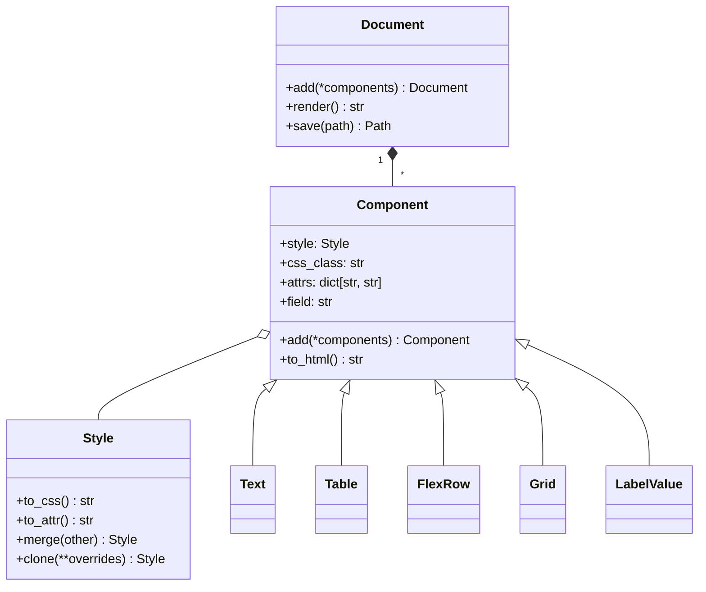

# Babu Document Digitization: Technical Documentation

The project turns Nepali document images into verified, printable HTML. It
contains a reusable HTML document engine, document-specific layout builders, an
OCR-based extraction pipeline, and an agentic controller that closes the loop
between extraction, rendering, verification, and repair.

## Architecture

```text
source image
  → OCR / Datalab extraction
  → structured JSON (validated against schema)
  → document builder  →  html_engine  →  HTML + PNG
  → vision verifier  →  human checkpoint  →  Architect Agent (bounded loop)
```

| Area | Location | Responsibility |
|---|---|---|
| HTML engine | `html_engine/` | Builds styled, strictly monochrome HTML. |
| Builders | `document_builder/` | Layouts for citizenship, laalpurja, and letter. |
| Extraction | `information_extraction/` | OCR extraction, field parsing, schema registry. |
| Controller | `agentic_controller/` | RAG index, renderer, vision verifier, Architect Agent, CLI. |
| Tests | `tests/` | Regression tests (currently the monochrome guarantee). |
| Outputs | `output/` | Generated HTML, PNG, and verification reports. |

---

## HTML document engine

`html_engine` is a dependency-light, declarative Python library for composing
printable documents from a tree of components. A `Document` owns page-level
configuration; `Style` objects produce inline CSS; each component renders itself
and its children to an HTML string.


```mermaid
classDiagram
    class Document {
        +add(*components) Document
        +render() str
        +save(path) Path
    }
    class Component {
        +style: Style
        +css_class: str
        +attrs: dict[str, str]
        +field: str
        +add(*components) Component
        +to_html() str
    }
    class Style {
        +to_css() str
        +to_attr() str
        +merge(other) Style
        +clone(**overrides) Style
    }
    Document "1" *-- "*" Component
    Component o-- Style
    Component <|-- Text
    Component <|-- Table
    Component <|-- FlexRow
    Component <|-- Grid
    Component <|-- LabelValue
```

### `Style` accepts any CSS property

`Style` is an open property bag, not a closed set of fields. Any keyword becomes
a CSS declaration:

```python
Style(user_select="none", backdrop_filter="blur(2px)", aspect_ratio="4 / 3")
# user-select:none;backdrop-filter:blur(2px);aspect-ratio:4 / 3
```

It was previously a dataclass with roughly ninety enumerated `Optional[str]`
fields. Anything outside that list raised `TypeError: Style.__init__() got an
unexpected keyword argument 'user_select'` from deep inside a builder, and the
pipeline reported it as a generic build failure. That design cannot hold here:
layouts are written by the Architect Agent from general CSS knowledge, not from
whatever list somebody remembered to enumerate. An unlisted property is a
cosmetic gap; killing a run over one is not proportionate.

| Name form | Emitted as | Example |
|---|---|---|
| `font_weight` | `font-weight` | underscores become hyphens |
| `_webkit_line_clamp` | `-webkit-line-clamp` | leading underscore is a vendor prefix |
| `--brand-gap` (via `**{}`) | `--brand-gap` | CSS custom property, passed through |
| `raw="box-shadow: 0 0 2px #000"` | appended verbatim | for anything not expressible as a kwarg |

**The trade:** a misspelling no longer raises. It is made visible instead —
`Style` emits a `StyleWarning` naming the property, which appears in a run log
and can be promoted to a hard error with `python main.py --strict` (or
`warnings.simplefilter("error", StyleWarning)`). Vendor prefixes and custom
properties are exempt, since neither is typo-shaped. A name CSS could never
accept at all (`9lives`, `font size`) still raises `ValueError`.

Two behaviours matter for correctness rather than convenience:

- **Shorthand is emitted before longhand.** CSS resolves duplicate declarations
  last-one-wins, so `margin` emitted after `margin-top` silently erases the
  specific value. `Style(margin_top="5px", margin="0")` produces
  `margin:0;margin-top:5px`, which is what the caller meant. Known properties
  render in a fixed order; unknown ones follow in insertion order.
- **`merge()` concatenates `raw` fragments** rather than replacing them, so
  merging a style that carries a `raw` shadow onto one that carries a `raw`
  filter keeps both. Every other property is overridden by the argument. Neither
  input is mutated. `clone(prop=None)` **removes** a property.

Unset properties read as `None` (`Style(margin="0").z_index is None`), so a
component can inspect a style without a `hasattr` dance.

### Monochrome enforcement

**Every rendered document is pure black and white** — `#000000` ink on
`#ffffff` surfaces. Not grayscale: strict binary. This is a hard project rule,
enforced structurally by `html_engine/monochrome.py` rather than by convention,
because a rule that can be bypassed is a rule that will be.

There are exactly four routes by which CSS can reach the page, and all four are
normalized:

| Route | Where it is closed |
|---|---|
| `Style(color=..., background=...)` fields | `Style.to_css()` → `normalize_value()` |
| `Style(raw="...")` escape hatch | `Style.to_css()` → `normalize_declarations()` |
| `attrs={"style": "..."}` on any component | `Component._render_attrs()` in `components/base.py` |
| `Document(extra_css=...)`, `background=...`, and engine-emitted CSS | `renderer.render()` → `normalize_html()` |

Public API:

| Function | Purpose |
|---|---|
| `normalize_value(prop, value)` | Normalize one declaration's value. |
| `normalize_declarations(css)` | Normalize an inline list or a full stylesheet. |
| `normalize_html(html)` | Normalize `style="..."` attributes and `<style>` blocks. |
| `find_violations(css)` | Return `[(prop, token)]` — for tests and auditing. |

Four design decisions are worth knowing, because each one prevents a specific
failure:

- **The target is keyed off the CSS property, not the colour's luminance.**
  `background*` goes white, everything else goes black. Luminance thresholding
  would map a dark fill and its light text to the same value, producing an
  unreadable black-on-black block.
- **`transparent`, `inherit`, `none`, `currentColor`, `auto` are preserved.**
  Rewriting `transparent` to white would paint an opaque panel over content
  beneath it.
- **All 148 CSS named colours are recognised, ordered longest-first.** A curated
  subset was tried first and leaked `rebeccapurple` — not an exotic choice for a
  model writing a layout, and any name missing from the list passes through as
  real colour. The ordering matters because regex alternation is scanned left to
  right: with `red` before `rebeccapurple`, the match consumes `red` and leaves
  `beccapurple` behind as stray text.
- **Text content is never touched** — only `style` attributes and `<style>`
  blocks. A land record may legitimately contain the string `#333`, and a
  digitizer that corrupts document data to satisfy a styling rule is worse than
  one that leaks a colour. `url(...)` values are stashed and restored for the
  same reason, so `url(/a#frag.png)` survives intact.

Verification treats colour as a non-issue in both directions: the verifier's
system prompt lists monochrome rendering as an *expected transformation*, so a
colourful source scan against a black-and-white replica is never reported as a
discrepancy. Judge a coloured source element only on whether its content is
present.

```bash
python tests/test_monochrome.py          # 17 tests, no pytest required
```

The suite is deliberately adversarial: it builds a document that tries to
smuggle colour through all four routes at once and asserts none of them work,
and it renders every registered layout and asserts `find_violations()` is empty.

### Editable fields (`field=`)

Every component accepts `field="<dotted path>"`, which attaches the two
attributes the editing contract needs:

```python
Text(d["owner_name"], field="owner_name")
LabelValue("Name", d["owner_name"], field="owner_name")   # lands on the value
corner_box("QR Code", corner="top-right", field="qr_placeholder")
```

`editable_attrs(field)` is the single source of that pair, so the contract is
defined in one place rather than restated in every layout. Explicitly-passed
`attrs` win over `field=` (it uses `setdefault`), which lets a layout mark a
node with a `data-field` without making it editable.

On `LabelValue` the field lands on the **value**, never the label — the label is
chrome, the value is extracted data. Wrapping both would make a browser edit
write `"Ref. No.: 084/85"` back into the field.

### Arbitrary HTML attributes (`attrs`)

Every `Component` subclass accepts an `attrs: dict[str, str]` parameter emitted
verbatim as HTML attributes. It remains available for anything `field=` does not
cover:

```python
Text(d["owner_name"], attrs={"contenteditable": "true", "data-field": "owner_name"})
LabelValue("Name", d["owner_name"], value_attrs={"contenteditable": "true", "data-field": "owner_name"})
```

`LabelValue` accepts a separate `value_attrs` dict targeting the inner value
`<div>` rather than the outer container.

### What a container accepts as a child

Containers (`Div`, `FlexRow`, `FlexCol`, grid and table cells, `Document.add()`)
take components, but a bare `str`, `int`, or `float` is coerced to a `Text`
node, and `None` is dropped. Anything else — a list, a dict, an arbitrary object
— raises `TypeError` naming the container, the child's position, and its type:

```python
Div("(Signed)")                 # → Div(Text("(Signed)"))
FlexCol(Text("a"), None)        # → the None is skipped
FlexRow(Text("a"), ["b", "c"])  # TypeError: FlexRow child at position 1 is list, …
```

The split is deliberate. A string child is unambiguous — there is exactly one
sensible reading — while a list child means the caller forgot to splat it, and
silently rendering `['b', 'c']` onto an official document is worse than
stopping. Before coercion existed, a generated layout containing `Div("")` was
accepted at construction and then failed deep in rendering with `'str' object
has no attribute 'to_html'`, a message naming neither the layout file, the
container, nor the offending string.

`bool` is rejected even though it is an `int` subclass: `Div(True)` is never a
request to print "True".

### Rendering

`Document.render()` traverses the component tree and returns a complete HTML
string; `Document.save()` writes it to disk, creating parent directories, and
returns the `Path`. `Document(extra_css=...)` injects additional CSS into the
`<head>` — builders use it for the contenteditable hover/focus styles:

```css
[contenteditable]:hover { outline: 2px dashed #000000; cursor: text; }
[contenteditable]:focus { outline: 2px solid #000000; background: #ffffff; }
```

`Document(clip=False)` disables the `overflow:hidden` that a fixed-height page
otherwise gets. The default `True` matches print. Set it to `False` while
debugging a page that seems to be losing its footer: a clipped overflow and a
genuinely missing section look identical in the rendered PNG, and the vision
verifier reports both as lost content.

### Component reference

| Group | Components |
|---|---|
| Text and media | `Text`, `Heading`, `Paragraph`, `Link`, `RawHTML`, `Image` |
| Layout | `Div`, `FlexRow`, `FlexCol`, `Grid`, `GridItem`, `AbsoluteBox`, `Card` |
| Fields | `LabelValue`, `FieldGroup`, `MultiFieldRow` |
| Tables | `Table`, `TableRow`, `TableCell` |
| Supporting | `Spacer`, `HorizontalRule`, `PageBreak`, `ListItem`, `UnorderedList`, `OrderedList` |
| Placeholders | `PlaceholderBox`, `Watermark`, `SignatureBlock`, `corner_box` |

Text components escape content by default. Use `RawHTML` or `escape=False` only
for trusted markup. `Image(embed=True)` embeds a local asset as a data URI,
making the HTML self-contained. `Text`, `Paragraph`, and `LabelValue` accept
`multiline=True`, which applies `white-space: pre-line` so newlines in extracted
data survive.

`Spacer` takes both `height` and `width`. A spacer given a `width` also gets
`flex-shrink: 0`, so a horizontal gutter inside a `FlexRow` is not squeezed
away by a greedy sibling.

### Placeholders for un-renderable furniture

A source scan carries a photo, a round office seal, an embossed crest, a
handwritten signature, a QR block, a watermark. None of that survives OCR, and
none of it should be invented. What the render owes the reader is an outline in
the right place at the right size, so the verifier compares **layout** rather
than reporting a missing seal as lost content.

Every layout was already drawing these by hand — an `AbsoluteBox` wrapping a
`Text` with a border, a radius, a flex-centring trio, and a font size, repeated
five times per document with slightly different numbers each time. These
components are that pattern, named.

| Component | Purpose |
|---|---|
| `PlaceholderBox(label, size=, shape=, dashed=)` | A labelled outline. `shape` is `"rect"`, `"rounded"`, or `"circle"`. |
| `Watermark(text, opacity=, rotate=)` | Faint centred text behind the page content. |
| `SignatureBlock(name=, title=, signature_label=, stamp_label=)` | The cluster closing an official letter. |
| `corner_box(label, corner=, size=, offset=)` | A placeholder pinned to one page corner. |

```python
doc.add(corner_box("Tribhuvan University Crest", corner="top-left", size="62px",
                   field="logo_placeholder"))
doc.add(Watermark("Clock Tower Watermark", font_size="86px", top="310px"))
doc.add(SignatureBlock(name=d["signed_name"], title=d["position"],
                       signature_label="(Signed)", stamp_label="Office Seal",
                       name_field="signed_name", title_field="position"))
```

Conventions the components encode:

- **Dashed means a human still has to supply it** (a signature); **solid means
  the original document simply has it** (a seal).
- `shape="circle"` uses `border-radius: 50%`, not a pixel radius, so the ellipse
  stays correct on a non-square box.
- A `Watermark` sets `z-index: 0`, `pointer-events: none`, and `user-select:
  none`. Those three properties are what separate a watermark from a heading: it
  never intercepts a click meant for an editable field underneath it, and never
  lands in the user's selection when someone copies a paragraph. Under the
  monochrome rule its only control is `opacity` — keep it low, since much above
  0.2 the verifier starts reporting the text over it as illegible.
- `corner_box` places by corner name. For an exact pixel position, compose it
  yourself: `AbsoluteBox(PlaceholderBox(...), top="124px", left="397px")`.

### Minimal example

```python
from html_engine import Document, Heading, LabelValue, Style

doc = Document(title="Certificate", page_width="1200px", lang="ne")
doc.add(
    Heading("Government of Nepal", level=1, style=Style(text_align="center")),
    LabelValue("Name", "राम बहादुर श्रेष्ठ", field="owner_name"),
)
doc.save("output/certificate.html")
```

---

## Building one document by hand

`main.py` is the manual counterpart to `python -m agentic_controller.run`: same
builders, same engine, no vision verifier and no repair loop. Use it while
iterating on a layout, when you want to see the render rather than pay for a
critique of it.

```bash
python main.py test-data/demo.png --type letter                       # OCR, then build
python main.py test-data/demo.png --type letter --save-data out.json  # keep the JSON
python main.py --type letter --data out.json                          # rebuild, no API call
python main.py --type laalpurja --blank --png                         # layout check only
```

| Flag | Default | Description |
|---|---|---|
| `image` | — | Source scan to OCR. Omit when using `--data` or `--blank` |
| `-t`, `--type` | `laalpurja` | Any discovered type; `--help` lists the current set |
| `-o`, `--output` | `output/<type>.html` | Output HTML path |
| `--data` | — | Build from this JSON instead of running OCR |
| `--save-data` | — | Write the extracted JSON for later `--data` runs |
| `--blank` | off | Every field empty — layout check, no OCR |
| `--png` | off | Also render a PNG (needs Chrome/Chromium) |
| `--strict` | off | Turn `StyleWarning` into an error |

Exactly one data source is required, checked before anything expensive runs.
`--data` and `--blank` never import the extractor, so neither costs an API call
— that is the point of the split, and `tests/test_main_cli.py` asserts it by
poisoning the extractor module and confirming the run still succeeds.

`--blank` fills every key in the schema's `required` list with `""`. Rendering
the layout's structure with no content in it is the quickest way to tell whether
a spacing problem belongs to the layout or to the extracted values.

---

## Document builders

`document_builder/registry.py` maps document type strings to a builder function
and its extraction schema path. It resolves both on demand from the filesystem;
`document_builder/resolver.py` holds the rules.

| Document type | Builder | Page geometry | Layout approach |
|---|---|---|---|
| `citizenship` | `citizenship/layout.py` | 1200 × 780 | Coordinate/absolute positioning for rigid single-page certificates. |
| `citizenship_back` | `citizenship_back/layout.py` | 1200 × 800 | Absolute positioning; thumb impressions and the officer signature are placeholders. |
| `laalpurja` | `laalpurja/layout.py` | 1200 × **auto** | Flow and table layout for variable-row land records with Devanagari numerals. |
| `letter` | `letter/layout.py` | 900 × 1320 | Flow layout for official correspondence, with placeholder furniture. |
| `income_certificate` | `income_certificate/layout.py` | agent-generated | Header block, income-source table, computed summary, signature footer. |
| `relationship_certificate` | `relationship_certificate/layout.py` | agent-generated | Reference header, body prose, family-member rows, certifying official. |
| `see_certificate` | `see_certificate/layout.py` | agent-generated | Examination board certificate; emblem, seal, and signature placeholders. |
| `tax_clearance` | `tax_clearance/layout.py` | agent-generated | Recipient block, income-items table, remarks, signature footer. |
| `transfer_certificate` | `transfer_certificate/layout.py` | agent-generated | School transfer record; student details and authentication block. |

The last five were written by the Architect Agent from a scan alone and reached
the registry with no code edit at all. `validate_layout` proves a layout
*builds*; it does not prove the layout resembles the scan, so treat generated
ones as drafts until the vision verifier has been over them.

Note that a generated type's first files are `layout.py` and `<type>.json` —
base names, not `layout_1.py` and `<type>_patched.json`. Generation used to write
the sidecar names, which read as consistent with the repair loop but inverted the
meaning: an unseen type has no original to protect, so the first layout written
*is* the rollback original. The result was five types standing on a sidecar with
no base underneath, and therefore no rollback floor — a later dangling `ACTIVE`
resolved to nothing and dropped the type out of discovery entirely instead of
degrading to a working layout. `_write_allowed()` protects `layout.py` and base
schemas that *exist*; a path that has never been written has no rollback value to
destroy.

### Which layout is live: the `ACTIVE` pointer

A repair never edits a layout in place. It writes the next free
`layout_<N>.py` beside the untouched `layout.py`, and promotion is a one-line
`ACTIVE` file naming the winner:

```
document_builder/citizenship_back/
    layout.py       # the rollback original — never written to
    layout_1.py     # a repair
    ACTIVE          # contains: layout_1.py
```

Absent, blank, or unreadable `ACTIVE` means `layout.py`, so a directory that has
never been patched carries no bookkeeping at all. That fallback is why every
type — hand-written or generated — keeps a `layout.py`: it is the floor a stale
pointer lands on, so a dangling `ACTIVE` costs a stale render rather than a
missing document type.

This replaced four hard-coded `from .<type>.layout import build_<type>`
statements at the top of `registry.py`, which had to be hand-edited after every
patch. Three distinct failures came out of that arrangement, and they share one
cause — resolving layouts at import time:

- **The pointer went dangling.** Promoting by hand meant copying the patch over
  `layout.py`, deleting `layout_N.py`, and editing `registry.py` to match. Do
  those in the wrong order and the import names a module that no longer exists.
  Because the imports were eager and top-level, `ModuleNotFoundError` on one
  layout made `DOCUMENTS` unimportable, which took out every document type and
  four of the six test suites with it.
- **The repair loop could not see its own repairs.** `run.py` builds through the
  registry while the agent writes `layout_N.py`. With the import fixed at
  startup, iteration 2 rebuilt iteration 1's *input*. Multi-iteration repair was
  a no-op unless a human edited `registry.py` mid-run — and the run printed that
  as though it were intended behaviour.
- **Schema repairs were invisible.** The registry hard-coded `<doc>.json` while
  `resolve_schema_path()` prefers `<doc>_patched.json`. A patched schema was
  written, reported, and then ignored by both `main.py` and the extraction
  pipeline.

Promotion is automatic but gated: `promote_layout()` is called only after
`validate_layout` has built the new layout on blank data. A layout that raises
stays on disk for inspection and does not become live, so the previous good one
keeps serving. Rolling back is editing one line; `git log` on `ACTIVE` is the
promotion history, and `layout.py` is byte-identical to what it always was.

Three details in `resolver.py` are load-bearing:

- **`ACTIVE` is agent-writable, so its contents are untrusted input.** The name
  is matched against `^layout(_\d+)?\.py$` before use — slashes, backslashes,
  `..`, and absolute paths never reach the filesystem.
- **Loading goes through `importlib.util.spec_from_file_location`, not
  `import_module`.** Two reasons, either sufficient: layout filenames are
  arbitrary, and a module-name import caches in `sys.modules`, which would serve
  the first-loaded layout for the life of the process. Mid-run promotion is the
  entire point, so the stale cache would defeat it. Each load gets a unique
  module name (`_babu_layout_<type>_<stem>`), registered before `exec_module` so
  `from __future__` imports resolve, and popped again if execution raises.
- **`DOCUMENTS` resolves per entry, lazily, and is not cached.** One broken
  layout breaks only its own type. Iterating `.items()` reads schema paths
  without executing any layout — `tests/test_registry_resolution.py` asserts
  that no `_babu_layout_*` module appears in `sys.modules` after a full sweep.
  Skipping the cache is deliberate: a promotion or generation must be visible to
  the process that performed it.

Each entry's schema path must name a file that exists on disk. Pointing an entry
at a generated-but-never-written schema (`letter_patched.json` did this) turns
every run of that type into a `FileNotFoundError` at extraction time, well away
from the registry line that caused it.

### Contenteditable output

Every data-bearing field emits `contenteditable="true"` and
`data-field="<path>"` on the value element. Top-level scalars use the field name
(`owner_name`); rows in variable-length lists use dotted notation
(`plots.0.plot_no`, `plots.2.area_sq_m`).

Opening the rendered HTML in a browser allows direct in-place editing. These
paths are the same keys the user-guided repair branch uses when feeding
corrections back into the pipeline, so **a layout that drops `data-field`
silently breaks human editing** even though it renders correctly.

### Adding a new document type

1. Create `document_builder/<type>/layout.py` with `build_<type>(data: dict) -> Document`.
2. Add a JSON extraction schema at `information_extraction/schemas/<type>.json`.

There is no third step. Any directory holding both is discovered automatically,
so the type is a valid `--type` on the next run with no code edit. `<type>` must
be a Python identifier, because it becomes part of `build_<type>` — a scan named
`tax-clearance.png` produces the document type `tax_clearance`.

Or skip both and let the Architect Agent generate them — see
`generate_resources` below.

### Generated layouts: geometry from the scan (`autolayout.py`)

A generated layout is not invented. `document_builder/autolayout.py` turns
Datalab's `/convert` block tree into layout source, and only what each block
*means* is left to the model.

```text
conversion  →  blocks_from_conversion  →  page_geometry  →  place
                                                              │
                     plan (from architect.plan_blocks)  ────→ │
                                                              ↓
                                                        layout_source
```

Everything in that top row is arithmetic — no model, no network, no API key — so
the same scan gives the same layout every time and a bad result is debuggable
rather than resampled. `tests/test_autolayout.py` runs the whole path offline
against a saved `/convert` reply in `tests/fixtures/`.

**The A4 contract.** The sheet is exactly A4 at 96 DPI — 794 × 1123 portrait or
1123 × 794 landscape — because that is the paper these documents are printed on.
Three rules make the source survive the trip onto it:

- **Orientation follows the source's own aspect.** A landscape citizenship
  certificate is not letterboxed onto a portrait page.
- **One scale for both axes.** `min(inner_w / extent_w, inner_h / extent_h)`.
  Two factors would fit the sheet exactly and distort every box doing it; the
  slack on the other axis becomes margin instead. This is the aspect-ratio
  guarantee, and the test suite asserts it directly rather than inferring it
  from a render.
- **The *ink extent* is normalized, not the page box.** The two disagree, and
  non-uniformly: on the citizenship scan the conversion page is 1372 × 980
  (aspect 1.400) around ink that is 1201 × 799 (aspect 1.503). Scaling against
  the page box would bake Datalab's own padding into the sheet.

Nothing is placed outside a 10 mm margin, so a printer's unprintable edge never
clips a field. Per block: `left = offset_x + (x0 - ink_x0) × scale`, and the
font size comes from the box height × 0.62 — a bbox is the line box, and cap
height plus descender is roughly that fraction of it, so a font sized to the
full box overflows. `fit_text` shrinks further when a translated string is
longer than the Devanagari it replaces.

**The semantic half** is `architect.plan_blocks`, one structured model call that
labels each block:

| Role | What is emitted | Where it goes |
|---|---|---|
| `static` | `Text('District Administration Office')` — the translation, baked in | nowhere; it is printed chrome |
| `value` | `Text(d['full_name'], field='full_name')` | a schema property, **and** `required` |
| `placeholder` | `PlaceholderBox('Official seal', shape='circle')` | nowhere |

Every value field lands in the schema's `required` list because `build_data`
keeps only what is listed there — a field the layout renders but the schema
omits would be permanently blank. A block with no plan entry still renders as
static text: dropping it would silently lose content the scan clearly had, and
the agent reviewing the render cannot ask back for something it cannot see.

A placeholder's caption is cut to fit its box. Datalab's `alt` is a full
sentence ("A color photograph of a man with short black hair, wearing a dark
suit jacket…"), which would overflow the box it labels. Shape follows whichever
the caption mentions first, round or rectangular, because a caption names its
subject before it says where the subject sits — "a red circular stamp
overlapping the photo" is a circle, not a photo box.

**Rebuilding an existing type.** `run.py --rebuild-layout` runs the same path
for a type that already has a layout, as a proposal only: the layout is written
to `layout_N.py` beside the original and the schema to the `<type>_patched.json`
sidecar, and `ACTIVE` moves only if `validate_layout` passes. `layout.py` is
never touched. Without the flag an existing type is untouched entirely.

---

## Information extraction

`information_extraction/` contains the digitization path; JSON schemas for each
document type live in `information_extraction/schemas/`.

Extraction uses **Datalab OCR** to read the source image and returns a
structured dict validated against the document schema. The builder receives
clean, validated fields — missing or uncertain values stay explicit rather than
being invented at render time.

> **`load_dotenv()` does not override existing environment variables.** A stale
> `DATALAB_API_KEY` exported from your shell profile silently shadows the
> correct key in `.env`, and the only symptom is a `401 Unauthorized` from
> datalab.to. Check `env | grep DATALAB` before editing `.env`.

### Translation (`translator.py`, `languages.py`)

Extraction returns values in the script they were printed in, usually
Devanagari. The rendered document is meant to be read by someone who cannot read
Nepali, so a translation stage sits between extraction and the builder:

```text
extract() → build_data() → translate_data() → builder(data)
```

Both pipelines run it by default — `information_extraction/pipeline.py`
(used by the agentic controller) and `main.py` — and both accept
`--no-translate` to skip it and `--lang` to choose the target.

`translate_data(data, target_language="en")` returns a `Translation` carrying the
new data, a flat `path → original value` map, counts, the language it rendered
into, and any error. Three rules shape the output:

| Rule | Example (`en`) | Example (`ja`) |
|---|---|---|
| Proper nouns are **transliterated**, not translated | `उमा देवी चौलागाई` → `Uma Devi Chaulagai` | → `ウマ・デヴィ・チャウラガイ` |
| Everything else is translated for meaning | `वंशज` → `By descent` | → `血統による` |
| Devanagari numerals become ASCII | `८` → `8` | `८` → `8` |
| Bikram Sambat dates become Gregorian | `२०४९/०३/०९` → `1992-06-23` | same |

Office names combine the first two: `जिल्ला प्रशासन कार्यालय, काठमाण्डौ` →
`District Administration Office, Kathmandu`, or `カトマンズ郡行政事務所`.

**Target languages live in one table.** `information_extraction/languages.py`
holds a frozen `LanguageSpec` per language in the `LANGUAGES` registry: the code
callers pass, the language's name for the prompt, whether its script is Latin,
and the three blocks of worked examples (transliteration, meaning, office names)
that a prompt needs written in the target script. The rules themselves do not
vary between languages, so `translator.py` keeps the shared prompt template and
each spec supplies only what differs. Adding a language is adding one entry. The
module imports nothing, so `main.py` can read `LANGUAGES` to build its `--lang`
choices without pulling in the OpenAI client or the OCR path.

**What is deliberately not sent to the model.** Bikram Sambat dates are converted
locally by `nepali_datetime`, because date arithmetic is precisely the class of
task an LLM gets subtly wrong; an unparseable or out-of-range date is returned
unchanged rather than half-converted, since a partial conversion prints a year
that looks Gregorian and is not. Bare numbers have nothing to translate. The
extractor's provenance siblings (`<field>_meta`, `<field>_citations`) are skipped
because they are never rendered.

Latin-script values are the interesting case, because whether they are finished
depends on the target. For an English target they are left alone. For a Japanese
one they are not — a document's printed English half, or a field OCR read as
English, is still untranslated for that reader — so `script_is_ascii` on the spec
decides. Identifiers are the exception in every language: a single token
containing a digit (`NM0000095`, `41-01-78-00466`) is printed as it is, and
sending it to a katakana-writing model would come back mangled.

**Sentinels are control flow, not content.** `present` / `absent` /
`unreadable signature` are OCR contract tokens that layouts branch on — a
thumb-impression box is drawn only when the value is `present`. Translating one
would silently remove an element from the page, so they are passed through
untouched, matched both by key and by value.

**Bilingual pairs are layout, not redundancy.** The SEE certificate prints
`certificate_title_np` on one line and `certificate_title_en` on the next;
several documents carry a `<field>_bs` date beside its `<field>_ad` twin.
Translating the script-preserved half makes the document say the same thing
twice, which is a page change dressed up as a wording change. `_PAIRED_SUFFIXES`
maps each such suffix to the English counterparts that suppress it, and the
suppression fires only when the sibling is actually present in the same dict —
a lone `foo_np` is the only value on the page and is translated normally. This
is deliberately keyed on structure rather than on a fixed list of field names,
so a generated document type gets the behaviour without being registered. The
table stays English-keyed whatever the target language: it describes the *source
document*, and a scan that prints both halves prints them regardless of what we
translate into.

**Nesting.** The walker handles lists of dicts, which is what a laalpurja's
`plots` table is: every row's fields are translated, and every row's metadata
siblings are left alone.

**Batching and cache.** All translatable values in a document go out in one
request keyed by opaque ids, split into a *label* batch and a *prose* batch
(whole sentences want different instructions). Batching is not only cheaper
than a call per field but more accurate — the model sees `district` and
`municipality` together and can tell a word is a place name. Repeated values (a
district down a table) are sent once and fanned back out. Results are cached on
disk in `information_extraction/.translation_cache.json`, keyed by
`(model, kind, target_language, text)`, so the repair loop's later iterations
re-translate nothing. The language belongs in that key — without it a Japanese
run is served the English hits an earlier run left behind. The cache is
gitignored; an unwritable cache makes a run slower, not failed.

**Degradation.** A failed model call is reported on the result, not raised: a
document rendered in Devanagari is more useful than no document. Local
conversions still apply in that case. A reply that omits keys leaves those
values at their originals rather than blanking them.

> **This changes what the verifier should accept.** Rule 1 in
> `verifier.py`'s `SYSTEM_PROMPT` and `verification-rules.md` used to declare
> Devanagari values the intended format. Both now say the output is fully
> translated and that a script difference is never a discrepancy — otherwise the
> vision model reports every translated value as a data-accuracy failure and
> the repair loop chases them forever.

---

## Agentic controller

`agentic_controller/` replaces the earlier LangGraph state machine with a
tool-calling agent loop. Where the old design constrained the LLM to a fixed
patch vocabulary — safe, but unable to generalize to an unseen document type —
the Architect Agent writes layout code directly, gated by a validation step.

| Module | Role |
|---|---|
| `rag_engine.py` | Semantic index over the codebase (Phase 1). |
| `architect.py` | The tool-calling agent: repair and generate (Phase 2). |
| `run.py` | End-to-end CLI with the human checkpoint (Phase 3). |
| `verifier.py` | Vision-model source-vs-render comparison. |
| `rendering.py` | HTML → PNG via headless Chrome. |
| `models.py` | `VerificationReport`, `RepairPlan`, and patch types. |
| *(`information_extraction/translator.py`)* | Translation of extracted values into the target language, before the builder. |
| `schema_patcher.py` | Applies schema patches to `*_patched.json` sidecars. |

### Pipeline flow (`run.py`)

```text
check resources ─(missing)─→ generate_resources
       │                            │
       └──────────────┬─────────────┘
                      ▼
        OCR → translate → build → render PNG → verify
                      ▼
             human checkpoint
        ┌─────────────┼──────────────┐
     approve        retry           edit
       END      analyze_and_repair  collect concerns
                      │                    │
                      └────── rebuild ─────┘
```

```bash
python -m agentic_controller.run path/to/document.png --document-type laalpurja
```

| Flag | Default | Description |
|---|---|---|
| `image` | *(required)* | Source document image |
| `-t`, `--document-type` | `laalpurja` | Document type |
| `--max-iterations` | `3` | Repair cycle cap |
| `--output-dir` | `output/` | Artifact directory |
| `--auto-approve` | off | Unattended: auto-fix while blocking issues remain, then accept |
| `--no-translate` | off | Keep extracted values in their original script |
| `-l`, `--lang` | `en` | Language to translate into (`en`, `ja`); also the language verification judges against |
| `--result-json` | — | Write the result and full history as JSON |

At the checkpoint: `a`/`approve` finishes, `r`/`retry` runs an autonomous
repair, `e`/`edit` collects free-text concerns and repairs using that guidance.
After `--max-iterations` cycles only `approve` is offered.

### Verification (`verifier.py`)

Both images are sent to the configured OpenAI vision model with a system prompt
that defines what "matched" means for this project. The model returns a
structured `VerificationReport`.

Expected transformations — **never** flagged as defects:

1. **Language** — both labels and values appear in the run's target language.
   A script difference is never a defect; a value is judged on whether it is the
   correct rendering in that language.
2. **Visual elements** — photographs, coats of arms, seals, stamps, thumb
   impressions, and signatures become bordered placeholder boxes with
   descriptive labels.
3. **Formatting** — clean digital typography replaces handwriting and scan
   artifacts. The output *should* look cleaner than the source.
4. **Handwritten elements** — replaced by typed text or placeholder labels.
5. **Colour** — the replica is deliberately monochrome; a colour difference is
   never a discrepancy.

What is actually checked: data accuracy (character by character), field
completeness, structural match, and placeholder correctness.

| Severity | Meaning |
|---|---|
| `minor` | Small inaccuracy that does not change meaning. |
| `major` | A data value is wrong, a field is missing, or a placeholder is mislabeled. |
| `critical` | Multiple fields wrong or missing, or structure fundamentally broken. |

`overall_match` is `pass` / `needs_review` / `fail`. If the source is too blurry
to confirm a value, the model says so and sets `needs_human_review` rather than
guessing.

The prompt is built per language by `verifier.build_prompt`; `SYSTEM_PROMPT` is
the English build of it. Rule 1 — the language rule — carries the target
language's name and its own worked examples, so a Japanese render is judged
against Japanese. Passing the wrong language turns every correctly translated
value into a reported discrepancy and the repair loop never converges, so
`run.py` forwards the same `--lang` it gave the translator.

The prompt is mirrored in prose in `documentation/verification-rules.md`.
**Change one, change the other** — the agent reads the markdown and the verifier
reads the prompt.

```bash
python -m agentic_controller.verifier source.jpg rendered.png --output report.json
python -m agentic_controller.verifier source.jpg rendered.png --lang ja
```

Sources may be PNG **or** JPEG; format is sniffed from magic bytes rather than
the file extension, so a mislabelled file still gets the right MIME type.

### Rendering (`rendering.py`)

`render_png()` derives its viewport from the page's own geometry instead of
using a fixed size. This matters more than it sounds: a viewport shorter than
the page silently crops it, and the verifier then reports the cut-off content as
a **major** layout defect — sending the repair agent off to fix a defect that
does not exist.

The `.page { width; height }` rule is parsed out of the rendered HTML and the
viewport is set to the page plus its `30px` margins. Pages declaring
`height: auto` cannot be measured from CSS, so they get a tall probe viewport
(`PROBE_HEIGHT = 4000`) and are cropped back afterwards. Cropping uses the
`.page` border as the ink bounding box, which also gives every document
identical framing regardless of viewport — uneven margins read to the verifier
as layout discrepancies that no layout change can fix.

If the crop comes back *shorter* than the declared height, content is genuinely
missing rather than clipped, and a warning is printed.

| Constant | Value | Role |
|---|---|---|
| `DEFAULT_SIZE` | `(1300, 1100)` | Fallback when geometry cannot be determined. |
| `PAGE_MARGIN` | `30` | Matches `margin:30px auto` from the renderer. |
| `PROBE_HEIGHT` | `4000` | Probe viewport for `height:auto` pages. |

Requires Chrome or Chromium; set `CHROME_EXECUTABLE` if it is not auto-detected.
Cropping needs Pillow and is skipped without it.

### RAG engine (`rag_engine.py`)

A semantic index that lets the agent retrieve the component signatures and
layout patterns it needs instead of being handed the whole codebase.

**Indexed:** `html_engine/`, `document_builder/`, `information_extraction/`, and
`documentation/*.md`.

`agentic_controller/` itself is **not** indexed, deliberately. Its bulk is
prompt text that is layout-adjacent but not layout-authoritative — retrieval
would surface it in competition with the real `html_engine` API, and an agent
retrieving its own instructions invites prompt echo. The verification vocabulary
it would contribute is already covered by the indexed
`documentation/verification-rules.md`.

**Chunking** is structural, not windowed: Python splits on top-level
`def`/`class` via `ast` so a chunk is a whole function with its docstring; JSON
schemas split per top-level property so a query about one field does not drag in
the whole schema; markdown splits on headings.

**Embeddings** are `sentence-transformers/all-MiniLM-L6-v2` (384-dim,
CPU-friendly), stored in a FAISS `IndexFlatIP` over L2-normalised vectors so
inner product is cosine similarity. Override with `RAG_EMBED_MODEL`.

**The index self-heals.** It is content-addressed: a manifest of file mtimes and
sizes is hashed to a digest and stored alongside the vectors, compared together
with the embedding-model name. `query_context()` takes `auto_rebuild=True` by
default and rebuilds when `index_is_stale()` returns true, so **no manual build
step is needed before an agent run.** Two caveats: the rebuild is synchronous,
so whichever run trips it pays a one-time full re-embed; and `SOURCE_DIRS` is an
allowlist, so edits to `agentic_controller/` do not mark the index stale at all.

```bash
python -m agentic_controller.rag_engine build [--force]
python -m agentic_controller.rag_engine query "how do I render a table" [-k 5]
python -m agentic_controller.rag_engine stats
```

### Architect Agent (`architect.py`)

Two entry points:

- **`analyze_and_repair()`** — a render exists and failed verification. The
  agent receives the `VerificationReport` plus both images and writes
  `layout_N.py` / `<doc>_patched.json`.
- **`generate_resources()`** — no layout or schema exists. Two routes, tried in
  order. **Geometry first**: `build_from_geometry()` derives every coordinate
  from the scan's own `/convert` block boxes (see *Generated layouts* above) and
  asks the model only what each block means. **The agent writing both files
  itself** is the original route and the fallback — it sees the source scan
  alone and must infer the structure, imitating an existing builder. Either way
  this is the feature that makes the pipeline self-extending; it was a
  `NotImplementedError` stub in the old controller.

The geometry route falls back rather than fails. No `DATALAB_API_KEY`, a
refused `/convert`, a page that segmented into nothing, a plan that did not
parse, or a `validate_layout` failure all hand the run to the agent route and
print why. It also **discards what it created** on the way out: a broken
`layout.py` left on disk would turn a fall-back into a permanently broken
document type, since a layout is what makes a type discoverable. Files that
already existed are left alone, so a `--rebuild-layout` run cannot delete the
layout in use.

Every call carries four context sources: the source scan, the rendered output
(absent on a from-scratch run), the current layout and schema paths, and
`html_engine` plus existing builders via the RAG index.
`documentation/verification-rules.md` is injected *directly* into the system
prompt rather than retrieved — it is small, needed on every call, and
prose-to-prose retrieval scored only 0.32–0.39 against it.

Agent tools: `query_context`, `read_file`, `write_file`, `execute_command`.

**Backend selection.** Anthropic is preferred when `ANTHROPIC_API_KEY` is
present — the tool-calling loop was designed against it and its image reasoning
is stronger. Falls back to any OpenAI-compatible endpoint, so a project with
only `OPENAI_API_KEY` still runs end to end. Force with
`ARCHITECT_BACKEND=anthropic|openai`; override the model with `ARCHITECT_MODEL`.

**The validation gate.** `validate_layout()` requires a generated module to
compile, import, expose a `build_<doc_type>` callable, **and render a full page
when that callable is invoked on blank data**, before any caller may use it.
This is what makes free-form code generation safe enough to ship.

The last of those four is the one that was missing, and it is the reason the
`user_select` crash reached the user. A function body does not execute until it
is called, so an import-only probe reported a layout as OK and the failure then
surfaced inside `build_document()` several stages later, where the traceback no
longer points at the layout. The probe now calls the builder, seeded with `""`
for every key in the schema's `required` list — the harsh case, so a lookup that
assumes content fails at the gate rather than on the one scan that happens to
omit it. `tests/test_layout_gate.py` covers a bad keyword inside the body, an
unguarded key lookup, and a builder returning a non-`Document`; each of those
passed the old gate.

The probe runs under `sys.executable`, not a bare `"python"`. It imports
`html_engine` and pydantic, so it has to use the same interpreter as the caller;
on a pyenv or conda machine `python` resolves through `PATH` to a shim without
this project's dependencies, and every layout would fail the gate with an
`ImportError` that says nothing about the layout. `PYTHON_EXECUTABLE` overrides
it when needed.

An unrecognized CSS property does **not** fail the gate — the engine warns and
renders. A cosmetic gap in a layout the agent just wrote is not worth discarding
the layout over.

**The verdict has to reach the caller.** `RepairResult` carries the gate's
outcome in two structured fields:

```python
layout_valid: bool | None     # None = the gate never ran
validation_message: str
promoted: Path | None         # the ACTIVE pointer, if this layout became live
```

Both `analyze_and_repair()` and `generate_resources()` set them, and
`describe()` prints `(validation: PASSED / FAILED / not run)`. This used to be a
`[VALIDATION FAILED]` prefix appended to the `summary` string, which nothing
parsed — so `run.py` printed "resources generated, review and register them"
over a layout the gate had already rejected, and the user found out on the next
run when `build_document()` raised. `run.py` now stops on
`gen.layout_valid is False`, returns `status="generated_invalid_layout"`, and
keeps the file for inspection.

`generate_resources()` was the more dangerous of the two, because it computed
`ok` and printed it but never assigned `result.layout_valid`. The guard in
`run.py` therefore read `None`, `is False` was never true, and the stop it
describes never fired for a generated layout. Harmless while promotion was
manual — a human read the traceback before wiring anything up — and not harmless
once passing the gate is what makes a layout live. `promoted` is set from the
same branch, so the two can never disagree: no promotion without a pass.

Five behaviours are load-bearing and easy to break:

1. **Re-extraction ordering** — the schema lands before OCR re-runs; callers
   must honour `RepairResult.needs_reextraction`.
2. **Patched-schema preference** — `resolve_schema_path()` prefers an existing
   `<doc>_patched.json` sidecar. Without it the pipeline re-extracts with the
   *unpatched* schema and every schema repair looks like a silent no-op.
3. **Iteration cap** — `MAX_REPAIR_ITERATIONS = 3`, with a forced stop.
4. **Append-only history** — every tool call is appended to
   `RepairResult.history`.
5. **Dotted-path edits** — `plots.0.plot_no` is the user-guided edit syntax and
   the `data-field` contract the layout must preserve.

Originals are never overwritten: `layout.py` stays intact for rollback and
iterations land beside it as `layout_1.py`, `layout_2.py`, … . Promotion writes
the one-line `ACTIVE` pointer and nothing else, so `layout.py` stays
byte-identical no matter how many repairs run — the manual process it replaced
copied the patch over `layout.py` and destroyed the rollback original the
invariant exists to protect. `current_layout_path()` returns whatever `ACTIVE`
names, which is not necessarily the newest file: an unpromoted `layout_3.py` sits
on disk while `ACTIVE` still names `layout_1.py`, and that is exactly what a
failed gate leaves behind. Use `latest_layout_path()` when you want the newest
one written rather than the one that builds. Base schemas are likewise off
limits; repairs land as `<doc>_patched.json`, which `resolve_schema_path()`
already prefers, so overwriting the base buys nothing and destroys the rollback
point.

**The command sandbox.** `execute_command` is the agent's read-only inspection
tool, and it was not read-only. Two independent holes let one agent run delete
`document_builder/citizenship_back/layout.py` and truncate
`information_extraction/schemas/citizenship_back.json` to zero bytes — both
writes `_write_allowed()` refuses through `write_file`. The promise above was
documented and unenforced.

The first hole was the allowlist itself: `python -c` was on it. That is arbitrary
code execution, and an allowlist containing a general-purpose interpreter is not
an allowlist. It is gone, and `python -m py_compile` covers the legitimate use.

The second was the shape of the check. The command string went to
`subprocess.run(..., shell=True)` behind a prefix match, and a prefix only ever
describes the first word. `cat README.md > schemas/citizenship_back.json` passes
as a `cat`; `ls; rm -rf document_builder` passes as an `ls`. Same for `&&`, `|`,
`$( )`, backticks, and an embedded newline. There is now no shell at all:
metacharacters are refused with the offending character named, the string is
split with `shlex.split()`, and `argv` is executed directly. A bare `python`
argv[0] is rewritten to `sys.executable` for the same pyenv/conda reason the gate
probe uses it.

Defence in depth on top of that: every command is bracketed by a snapshot of the
protected originals — each `layout.py` under `document_builder/` and every schema
that is not a `_patched` sidecar. If a command changes or deletes one, the bytes
are put back and the restore is reported into the tool result, so the agent is
told what it did instead of silently succeeding. `_protected_originals()`
deliberately excludes `layout_N.py` and `_patched.json`: those are the agent's
workspace, not originals.

`tests/test_command_sandbox.py` has one test per route that previously reached
the filesystem, including an assertion that a redirection attempt leaves the
schema's bytes untouched.

```bash
python -m agentic_controller.architect repair <type> source.png rendered.png [--report r.json] [--concerns "..."]
python -m agentic_controller.architect generate <type> source.png [--notes "..."]
```

Omitting `--report` runs the verifier first.

---

## Future work

### Visual editor

Planned in detail in [FRONTEND-PLAN.md](FRONTEND-PLAN.md): a Next.js editor over
a FastAPI layer, with a shared Document JSON schema as the contract between it
and this engine.

The `contenteditable` + `data-field` attributes on every value element are the
existing groundwork. Those `data-field` paths are extraction-schema keys, and the
plan reuses them as element metadata rather than inventing a second identifier
space.

### PDF export

`Document` currently exposes `add`, `render`, and `save` only. A print path
(WeasyPrint or headless-Chrome print-to-PDF) would reuse the existing page
geometry; the monochrome guarantee already makes output print-safe.

### OCR tooling candidates under evaluation

Listed in `documentation/tasks.txt` as alternatives or supplements to Datalab:

- **Handwritten Nepali OCR** — TrOCR fine-tune, Tesseract
- **Layout analysis** — LayoutParser, DocLayout-YOLO
- **End-to-end OCR** — Donut, Surya
- **Document segmentation** — Segment Anything Model (SAM)
- **Preprocessing** — CamScanner-style scan rectification

---

## Setup and common commands

```bash
python3 -m venv .venv
source .venv/bin/activate
pip install -r requirements.txt

cp .env.example .env
# DATALAB_API_KEY  — OCR extraction
# OPENAI_API_KEY   — vision verifier (and agent fallback)
# ANTHROPIC_API_KEY — Architect Agent, preferred when present

# Run the full pipeline
python -m agentic_controller.run path/to/document.png --document-type laalpurja

# Build one document by hand — no verifier, no repair loop
python main.py path/to/document.png --type letter
python main.py --type laalpurja --blank --png --strict

# Generate sample layouts
python document_builder/citizenship/test-generate-citzenship.py
python document_builder/laalpurja/test-generate-laalpurja.py

# Verify a render pair standalone
python -m agentic_controller.verifier source.jpg rendered.png --output report.json

# Repair / generate standalone
python -m agentic_controller.architect repair laalpurja source.png rendered.png
python -m agentic_controller.architect generate <type> source.png --notes "..."

# Search the code index
python -m agentic_controller.rag_engine query "how do I center a heading"
python -m agentic_controller.rag_engine stats

# Tests — all 10 suites, 183 tests, no pytest needed
python tests/run_all.py
python tests/test_styles.py        # or one suite directly
```

| Suite | Covers |
|---|---|
| `test_styles.py` | Open `Style`: any property renders, typos warn, shorthand orders before longhand |
| `test_monochrome.py` | All four CSS routes to the page, plus every registered layout |
| `test_components.py` | Placeholders, watermark inertness, signature block, the `field=` contract, child coercion |
| `test_layout_gate.py` | `validate_layout` catches errors inside a builder body, not just at import |
| `test_autolayout.py` | The geometry half, run offline against a saved `/convert` reply: every block parsed, the extent taken from the ink rather than the page, one scale for both axes, the fit centred inside the margin, reading order and relative position preserved, captions cut to their box, and the emitted module passing the same four gates with every field still surviving `build_data` |
| `test_main_cli.py` | `--blank` / `--data` never reach OCR; argument validation |
| `test_command_sandbox.py` | Every route `execute_command` used to leave open: `python -c`, redirection, chaining, substitution, newlines; the originals guard; and `_write_allowed()` refusing an *existing* `layout.py` or base schema while permitting a brand-new type to create its own |
| `test_registry_resolution.py` | `ACTIVE` selects the live layout and degrades to `layout.py` rather than raising; traversal in `ACTIVE` is rejected; discovery finds new types and skips incomplete ones; promotion round-trips and takes effect inside one process; iteration imports no layouts |
| `test_translator.py` | Which values reach the model and which never do — sentinels, values already in the target script, metadata siblings, and the source-script half of a bilingual pair; BS dates convert locally and refuse to half-convert; nested `plots` rows are walked and their metadata preserved; duplicates are sent once; a failed or partial reply degrades to the original values; the cache spares the second run and is keyed on model *and* target language; and the target language reaches the model, is reported back, is refused by name when unsupported, and changes which values count as already-translated |
| `test_verifier_prompt.py` | The verification prompt is a pure function of the language spec: it names the target language, each language carries its own worked examples, the four non-language rules are shared verbatim, the rules stay numbered 1–5 because `verification-rules.md` mirrors them, `SYSTEM_PROMPT` is byte-identical to the English build, and an unsupported language raises |

There is no pytest dependency. Each suite is an ordinary script that asserts and
prints; `run_all.py` is the `&&` chain, written once, and exits non-zero if any
suite fails, so it works as a CI gate.

PNG rendering requires Chrome or Chromium. The vision verifier uploads both
images to the configured OpenAI model — only use documents whose handling has
been approved.
