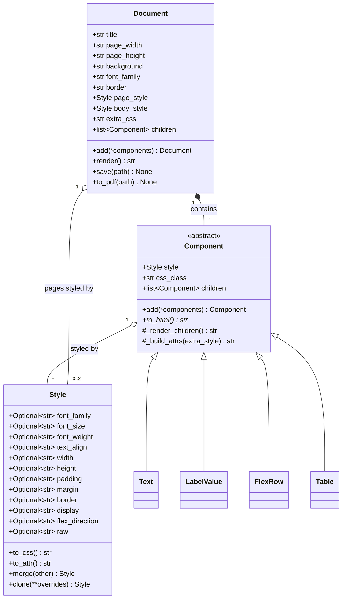
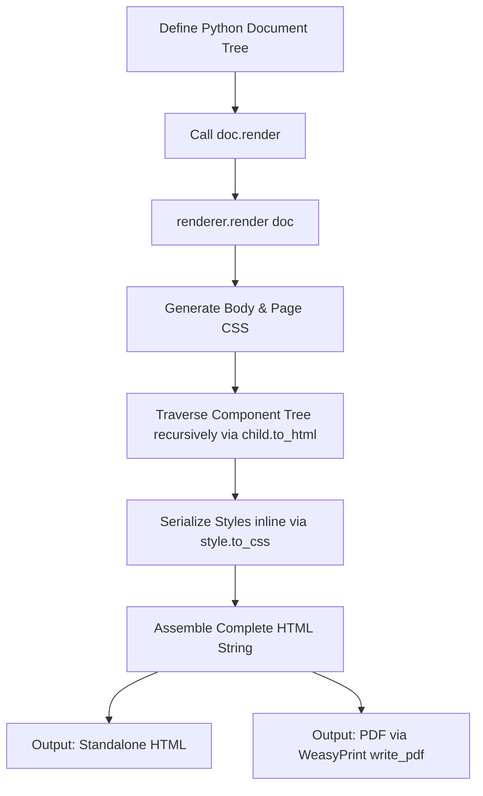

# HTML Document Engine & Builder: Software Documentation

This documentation provides an architectural analysis, component catalog, usage guide, and recommendations for the **HTML Document Engine** (`html_engine`) and **Document Builder** (`document_builder`) codebase. 

The HTML Document Engine is a lightweight, zero-dependency (excluding PDF generation) Python framework designed to build pixel-perfect, printable A4 HTML documents and PDFs programmatically. Instead of relying on HTML/Jinja2 templates, developers compose documents dynamically using typed Python components and styles.

---

## 1. Architectural Design & Class Hierarchy

The engine follows a declarative tree-structured design where a top-level `Document` acts as the root, and the layout is built by nesting `Component` subclasses. Styling is handled by a unified, immutable-ish `Style` dataclass.

### Core Class Diagram


### Key Elements of the Architecture

1. **`html_engine.styles.Style`**:
   - A Python `dataclass` representing standard CSS properties (typography, box model, layout, Flexbox, Grid, etc.).
   - Attributes default to `None`. When rendered, `None` values are omitted.
   - Converts Python snake_case attribute names to CSS-compatible kebab-case (e.g., `font_weight` -> `font-weight`).
   - Supports merging (`style_a.merge(style_b)` or `style_a + style_b`), where the right-hand style overrides the left-hand style.
   - Features a `raw` property as an "escape hatch" to append custom, unscheduled CSS strings directly.

2. **`html_engine.components.base.Component`**:
   - The abstract base class (`ABC`) for all layout blocks.
   - Provides default tree manipulation (`add()` for child components) and HTML attribute building utilities (`_build_attrs()`).
   - Forces subclasses to implement `to_html()`.
   - Combines its instance `style` with any caller-provided `extra_style` and its `css_class` to produce the final `class="..." style="..."` attribute string.

3. **`html_engine.document.Document`**:
   - The document container that manages pages and coordinates document-wide styling (such as A4 margins, global font family, page borders, and paper backgrounds).
   - Serves as the entrypoint for rendering and file output (HTML and PDF).

---

## 2. The Rendering Pipeline

The rendering pipeline transforms the tree of Python objects into a fully realized, styled HTML page.



### Details of the Pipeline Stages
- **CSS Generation**: Global stylesheets are written directly into a `<style>` block in the HTML `<head>`. This includes body styles, `.page` container rules, `@media print` directives (for margins, page-breaks, hiding elements), and any custom string passed to `doc.extra_css`.
- **Component Traversal**: The renderer invokes `to_html()` on each child of `Document`. If a component contains children (e.g. `FlexRow`, `Table`, `Div`), it calls `_render_children()`, which propagates the traversal down the tree.
- **Inline Styling**: Since there are no external stylesheets, all custom component styling is applied as inline `style="..."` attributes. This isolates styles to their specific nodes and ensures high compatibility across HTML engines and PDF converters.
- **PDF Compilation**: The `.to_pdf(path)` method utilizes `weasyprint.HTML` to parse the rendered HTML string and compile it directly into a PDF document, respecting print media rules.

---

## 3. Component Catalog

The library divides components into functional categories:

### 3.1 Layout & Grid Components
- **`Div`**: The basic wrapper element (`<div>`). Used to group children and apply generic styles (such as background colors, borders, or padding).
- **`FlexRow` / `FlexCol`**: Flexbox layouts with preconfigured `display: flex` and `flex-direction` (row or column). Accept a `gap` parameter to set item spacing.
- **`AbsoluteBox`**: A wrapper that enforces `position: absolute`. It accepts `top`, `right`, `bottom`, and `left` arguments, facilitating precise coordinate positioning. Perfect for watermark text, stamps, signatures, or photos in certificates.

### 3.2 Content Components
- **`Text`**: Renders inline text wrapped in a `<span>` tag.
- **`Heading`**: Renders a standard heading tag (`<h1>` to `<h6>`) determined by the `level` property.
- **`Paragraph`**: Renders block text wrapped in a `<p>` tag.
- **`RawHTML`**: An escape hatch that renders raw HTML strings verbatim. Useful for adding `<br>` breaks or external script tags.
- **`Image`**: Renders an `` tag.
  - *Feature*: If `embed=True` and `src` is a local file, it reads and converts the file into a base64 Data URI (`data:image/...;base64,...`), compiling it directly into the HTML to make it standalone.
  - *Feature*: If `grayscale=True`, it automatically appends a `filter: grayscale(100%)` CSS style.

### 3.3 Data & Form Fields
- **`LabelValue`**: A flex-based container displaying a label (left, fixed width) and a value (right, flex-grow). The value can be a string or a nested `Component` (e.g., a `FlexCol` container for multi-line details).
- **`FieldGroup`**: A vertical layout wrapper for lists of `LabelValue` pairs. It appends a configurable `margin-bottom` spacing (`spacing="18px"` by default) to every child except the last.
- **`MultiFieldRow`**: A horizontal layout wrapper that places multiple `LabelValue` components next to each other on a single row.

### 3.4 Tables
- **`Table`**: Renders an HTML `<table>`.
  - Supports quick creation using lists: `headers=["Col 1", "Col 2"]` and `rows=[["A1", "A2"], ["B1", "B2"]]`.
  - Supports detailed, granular configuration via child `TableRow` and `TableCell` objects passed to `children`.
  - Incorporates `thead_rows` and `tfoot_rows` lists to represent structured headers and footers.
- **`TableRow`**: A table row (`<tr>`). Automatically wraps string inputs in standard `TableCell` wrappers.
- **`TableCell`**: A table cell (`<td>` or `<th>` depending on `is_header`). Supports `colspan` and `rowspan` parameters for cell-merging.

---

## 4. Document Builders in Practice

The `document_builder` directory contains two implementations illustrating different layouts:

### 1. Nepali Citizenship Certificate (`document_builder/citizenship`)
- **Layout Strategy**: *Coordinate-based / Absolute Layout*.
- **Mechanism**: The page height is fixed (`page_height="820px"`), and elements are positioned using `AbsoluteBox` wrappers. The logo, official stamp, title block, photo, details table, and officer signatures are assigned explicit coordinate parameters (e.g. `top="255px"`, `left="55px"`).
- **Suitability**: High-fidelity reproduction of single-page government documents, certificates, and ID cards where positions must remain rigid regardless of content length.

### 2. Land Ownership Certificate (Laal Purja) (`document_builder/laalpurja`)
- **Layout Strategy**: *Flow-based Layout*.
- **Mechanism**: The page height is dynamic (`page_height="auto"` with `min_height="840px"`), allowing content to expand vertically. It uses flex rows to organize the photo, thumb impression box, and details panel horizontally, followed by a dynamically generated `Table` for land plots.
- **Suitability**: Multi-item registers, invoices, receipts, and structured business records where content size varies (e.g., the number of land plots listed can scale).

---

## 5. Usage Guide: Building a General Document

The engine can easily be used to build general-purpose documents like business letters, invoices, and reports.

### Example: Generating a Business Invoice
Here is how you can use the component library to build a professional, styled invoice:

```python
from html_engine import Document, Style, Heading, Paragraph, Text, FlexRow, FlexCol, Table, TableRow, TableCell, Spacer, HorizontalRule

def generate_invoice(invoice_id: str, client_name: str, items: list[dict]) -> Document:
    # 1. Initialize document structure
    doc = Document(
        title=f"Invoice {invoice_id}",
        page_width="800px",
        page_height="auto",
        min_height="1000px",
        background="#ffffff",
        border="1px solid #ddd",
        font_family="'Inter', sans-serif"
    )
    
    # 2. Base styles
    bold_text = Style(font_weight="bold")
    muted_text = Style(color="#666", font_size="14px")
    cell_style = Style(border_bottom="1px solid #eee", padding="12px", font_size="14px")
    header_cell_style = Style(background="#f9f9f9", border_bottom="2px solid #ddd", padding="12px", font_weight="bold", font_size="14px")
    
    # 3. Header Section (Flex Row)
    header = FlexRow(
        FlexCol(
            Heading("Acme Corp", level=2, style=Style(margin="0", color="#1a73e8")),
            Paragraph("123 Business Rd, New York", style=muted_text.clone(margin="4px 0 0 0"))
        ),
        FlexCol(
            Heading("INVOICE", level=1, style=Style(margin="0", text_align="right", color="#333")),
            Paragraph(f"Invoice #: {invoice_id}", style=bold_text.clone(text_align="right", margin="4px 0 0 0")),
            style=Style(align_items="flex-end")
        ),
        style=Style(justify_content="space-between", align_items="center")
    )
    doc.add(header)
    doc.add(Spacer(height="30px"))
    doc.add(HorizontalRule())
    doc.add(Spacer(height="20px"))
    
    # 4. Client Details
    client_info = FlexRow(
        FlexCol(
            Text("Billed To:", style=bold_text.clone(color="#666")),
            Text(client_name, style=bold_text.clone(font_size="18px", margin_top="6px")),
            Text("Client Address Street 4", style=muted_text.clone(margin_top="4px")),
        ),
        style=Style(margin_bottom="30px")
    )
    doc.add(client_info)
    
    # 5. Build Items Table
    table_rows = []
    grand_total = 0.0
    
    for item in items:
        subtotal = item['qty'] * item['price']
        grand_total += subtotal
        table_rows.append(
            TableRow(
                item['name'],
                str(item['qty']),
                f"${item['price']:.2f}",
                f"${subtotal:.2f}",
                cell_style=cell_style
            )
        )
        
    invoice_table = Table(
        headers=[
            TableCell("Item Description", style=header_cell_style.clone(text_align="left")),
            TableCell("Qty", style=header_cell_style),
            TableCell("Unit Price", style=header_cell_style),
            TableCell("Amount", style=header_cell_style.clone(text_align="right"))
        ],
        children=table_rows,
        tfoot_rows=[
            TableRow(
                TableCell("Total Due:", colspan=3, style=Style(text_align="right", font_weight="bold", padding="12px")),
                TableCell(f"${grand_total:.2f}", style=Style(text_align="right", font_weight="bold", padding="12px", color="#1a73e8", font_size="18px"))
            )
        ]
    )
    doc.add(invoice_table)
    
    # 6. Save and Export
    doc.save("invoice.html")
    doc.to_pdf("invoice.pdf")
    return doc

# Usage
items_list = [
    {"name": "Consulting Services (hr)", "qty": 10, "price": 150.0},
    {"name": "System Architecture Design", "qty": 1, "price": 2500.0}
]
generate_invoice("INV-2026-001", "John Doe Corp", items_list)
```

---

## 6. Implementation Fixes & Remaining Deficiencies

### 6.1 Mismatched Package Import Paths (Fixed)
Previously, layout generation scripts and package headers references referred to a non-existent `documents` directory (e.g. importing from `documents.citizenship.layout`). This has been successfully fixed:
* **Citizenship Generator**: [citizenship/generate.py](file:///home/moon/pragya/babu-documentation/document_builder/citizenship/generate.py) now imports correctly from `document_builder.citizenship.layout` and points its usage docs to `document_builder/citizenship/generate.py`.
* **Laal Purja Generator**: [laalpurja/generate.py](file:///home/moon/pragya/babu-documentation/document_builder/laalpurja/generate.py) docstring references have been corrected to `document_builder`.
* **Redundant Initializers Removed**: In Python 3.3+, implicit namespace packages do not require boilerplate `__init__.py` files unless they publish properties.
  - The comment-only `document_builder/__init__.py` was removed.
  - The hidden and broken file `document_builder/laalpurja/.__init__.py` (which attempted to import from `documents`) was removed.
  - Python scripts compile and execute successfully.

### 6.2 Missing HTML Escaping (Security and Robustness Issue)
The components print input strings directly to HTML markup:
* **Example in file**: [text.py:L35](file:///home/moon/pragya/babu-documentation/html_engine/components/text.py#L35)
  `return f"<span{attrs}>{self.content}</span>"`
* **Defect**: If data contains characters like `<` or `&`, the rendering breaks. If the data is derived from unverified OCR transcriptions, this exposes the application to **HTML Injection** and **Cross-Site Scripting (XSS)**.
* **Fix Required**: Wrap text contents in `html.escape()` before appending them to the templates.

### 6.3 Missing base_url in PDF Generation (Asset Resolution Defect)
In [pdf.py:L12](file:///home/moon/pragya/babu-documentation/html_engine/pdf.py#L12):
* **Defect**: WeasyPrint needs a `base_url` directory reference to locate local image sources (such as `owner_photo.png` or `your-photo.jpg`) when compile-to-PDF is called. Since `base_url` is omitted, relative path resources fail to render inside PDF outputs.
* **Fix Required**: Allow passing an optional `base_url` to `html_to_pdf` and default it to the output directory's parent folder.

---

## 7. Recommended Enhancements for General Document Building

To transform this system into a robust, general-purpose document publishing pipeline, we recommend implementing the following features:

### 1. Multi-Page Document & Pagination Support
General documents (long reports, contracts, manuals) require proper pagination.
* **Proposal**: Leverage CSS Paged Media (`@page` rules). Create a `PageBreak` component that translates to `<div style="page-break-after: always;"></div>` in CSS.
* **Running Headers/Footers**: Introduce page count variables (`counter(page)` and `counter(pages)`) via `@page` margin boxes, e.g.:
  ```css
  @page {
      @bottom-right {
          content: "Page " counter(page) " of " counter(pages);
          font-family: Arial, sans-serif;
          font-size: 10px;
      }
  }
  ```

### 2. Auto-Escaping String Inputs
Secure the HTML rendering process by default.
* **Proposal**: Update `Text`, `Heading`, `Paragraph`, and `LabelValue` components to automatically run `html.escape()` on string parameters. Provide a separate `RawHTML` component when unescaped HTML insertion is explicitly required.

### 3. Type-Safe Style Attributes & Unit Helpers
Prevent formatting bugs caused by spelling mistakes or omitted unit strings.
* **Proposal**: Create helper functions or enums for units and colors instead of relying solely on strings, e.g.:
  ```python
  from enum import Enum
  
  class Align(Enum):
      LEFT = "left"
      CENTER = "center"
      RIGHT = "right"

  def px(value: int) -> str:
      return f"{value}px"

  def pct(value: float) -> str:
      return f"{value}%"
  ```

### 4. 12-Column Grid Layout Component
Flexbox requires complex nesting calculations. Implementing a standard 12-column grid makes building dynamic layouts simpler.
* **Proposal**: Introduce a `Grid` container and `GridItem` child components using CSS Grid backend support:
  ```python
  class Grid(Component):
      def __init__(self, cols: int = 12, gap: str = "15px", **kwargs):
          super().__init__(style=Style(display="grid", grid_template_columns=f"repeat({cols}, 1fr)", gap=gap), **kwargs)
  ```

### 5. Extended Core Component Library
Add components for common formatting needs:
* **`Link`**: Support clickable hyperlink wrappers (`<a>`).
* **`UnorderedList` / `OrderedList` / `ListItem`**: Dedicated Python abstractions for `<ul>`/`<ol>` bullets.
* **`Card` / `Container`**: Preset styles for shadows, borders, padding, and rounded corners, avoiding repetitive `Style` constructor calls.

